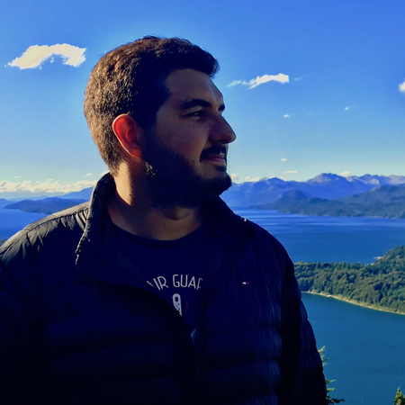

<section class="intro-info">
  
</section>
<section class="content-description">
  <h2 class="content-lead">Hi, I'm <strong>Sebastian</strong>.</h2>
  
I'm a 26 years old Production Coordinator with 3+ years of experience in 3D animation studios and video game companies from Buenos Aires, Argentina.

  
Graduated as Image and Sound Designer from Universidad de Palermo, I moved to Toronto, Ontario, in May 2018 with an open work permit and am currently <strong class="content-highlight">seeking for job opportunities</strong>.

  
I'm an ambitious and passionate professional, who’s fully dedicated to the audiovisual industry, from film to video games and TV series. I have a solid foundation on CGI, having learnt through formal education and by myself. This allows me to interact smoothly from a technical and creative point of view in any production.

  
I study everyday of my life to have a broad set of skills, from technical aspects to production, marketing, team management and product development. My main goal is always focused on managing and delivering products and projects with the highest quality standards, whilst getting things done.

</section>
